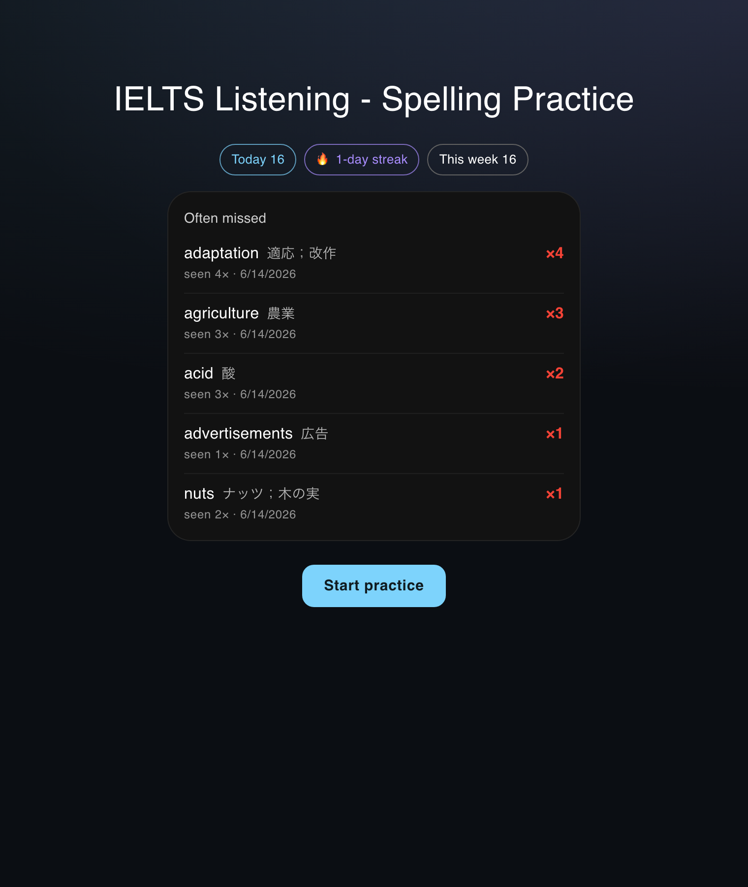
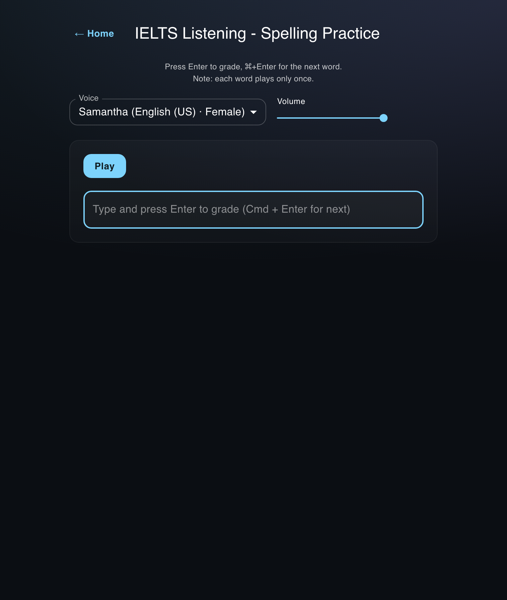
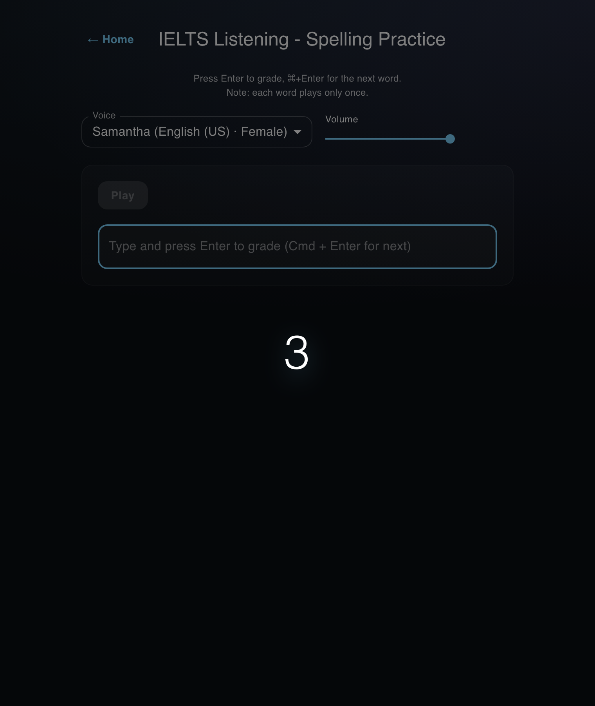
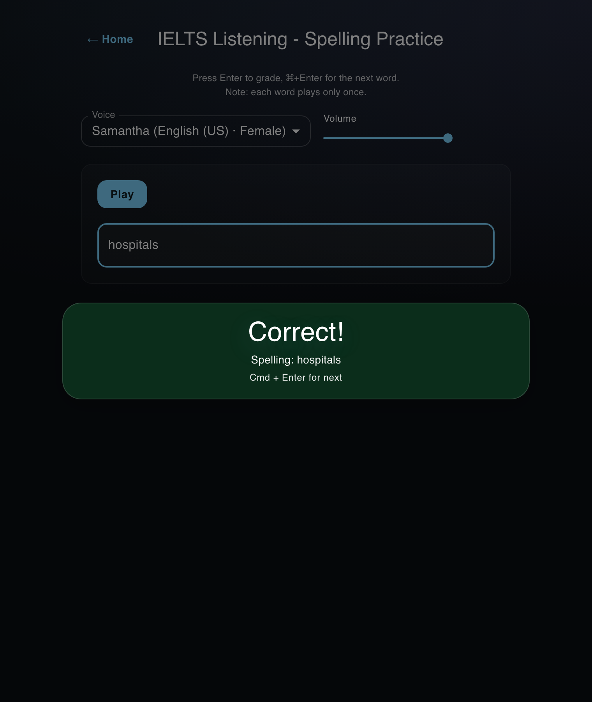
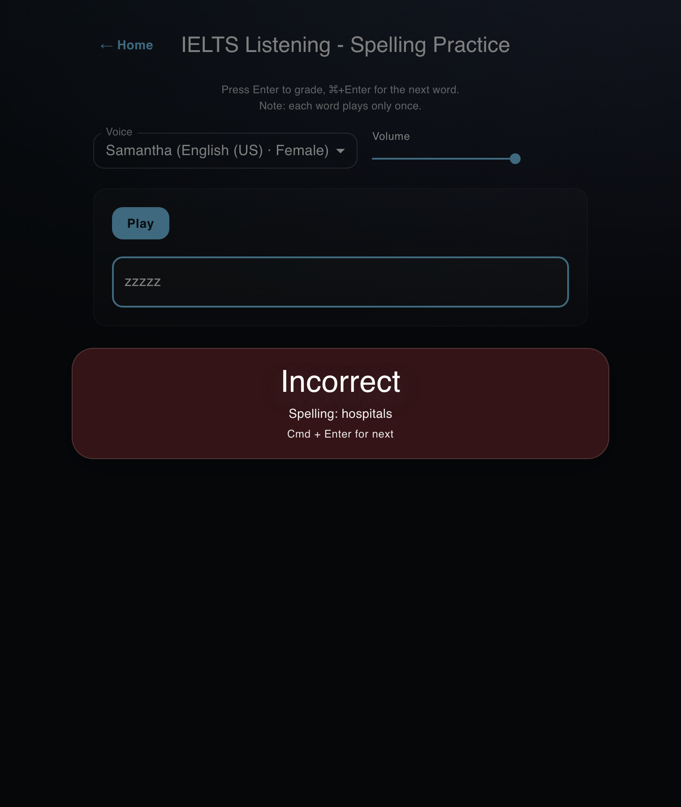
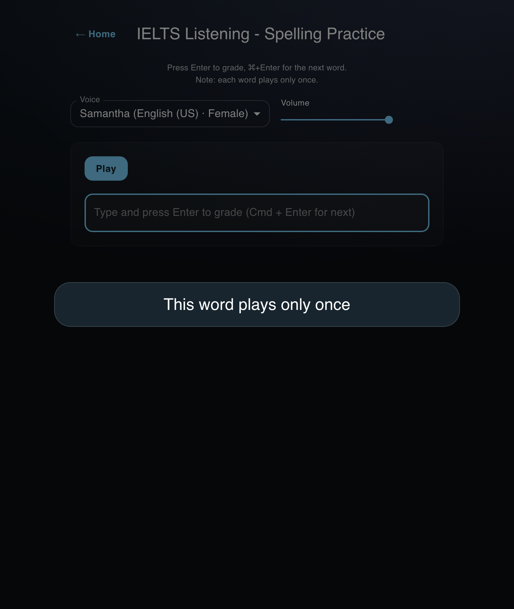

# IELTS Listening — Spelling Practice

A local web app that drills the one IELTS skill that quietly costs points: **hearing a word and spelling it correctly**. After a short countdown a word is played **once**, you type it, and you are graded instantly. No account, no network — everything runs on your machine.

> _Personal project · work in progress · macOS only._

## Why I built this

- I kept losing easy marks to **spelling mistakes in IELTS Listening** — not to comprehension.
- Similar drills exist on YouTube, but they **move at the video's pace, not mine** — and you end up hand-writing every word you miss. I wanted to repeat on demand, go at my own pace, and let the app remember my mistakes.
- I couldn't find a single tool focused **only on IELTS Listening spelling** — so I built one.

## Key features

- 🎧 **Play once** — a 3‑2‑1 countdown, then the word is spoken a single time via local TTS (macOS `say`). No replays, just like the real test.
- ⌨️ **Keyboard‑first** — `Enter` to grade, `⌘ + Enter` for the next word, `⌘ + R` to play.
- ✅ **Forgiving grading** — case, hyphen/space, and UK/US spelling (colour ↔ color) are normalized before matching.
- 🔁 **Targets your mistakes** — missed words are weighted to reappear; stats persist in `SQLite`.
- 📊 **Progress at a glance** — the home screen shows your streak, weekly count, and most-missed words.
- 🗣️ **Pick voice & volume** — switch between US / UK voices; preferences are saved in `localStorage`.
- 🌙 **Easy‑on‑the‑eyes dark UI** (MUI).

## Screenshots

|                                 Home                                  |                                   Practice                                    |
| :-------------------------------------------------------------------: | :---------------------------------------------------------------------------: |
|  |  |
|               Streak, weekly count & most-missed words                |                     Voice, volume, and input in one view                      |

|                                   Countdown                                    |                                  Result — correct                                  |
| :----------------------------------------------------------------------------: | :--------------------------------------------------------------------------------: |
|  |  |
|                            Played once after 3‑2‑1                             |                        Verdict + correct spelling, centered                        |

|                                   Result — incorrect                                   |                                         "Play once" guard                                         |
| :------------------------------------------------------------------------------------: | :-----------------------------------------------------------------------------------------------: |
|  |  |
|                           Shows the right spelling to review                           |                             Replays are blocked after the first play                              |

## Tech stack

- **Frontend:** Vite + React + TypeScript, MUI (dark theme)
- **Backend:** Node.js + Express (local‑only API)
- **Speech:** `say` — macOS system voices
- **Storage:** `localStorage` for settings, `SQLite` (`better-sqlite3`) for stats
- **Data:** word list in `assets/words/words.json`

## Requirements

macOS (uses the `say` command) · Node 22 (pinned via `.nvmrc`).

## Documentation

Full requirements, data model, API reference, grading algorithm, and setup: **[ARCHITECTURE.md](./ARCHITECTURE.md)**.

## Word list

The app needs a word list at `assets/words/words.json` to run. I keep a hand-curated set of **741 IELTS Listening words** — want a copy? Email me: **umasotest27@gmail.com**.

## License

Released under the [MIT License](./LICENSE).

## Trademark notice

This project is not affiliated with IELTS® or its owners. IELTS is a registered trademark of its respective owners. This is an unofficial, open‑source tool intended for personal study.
